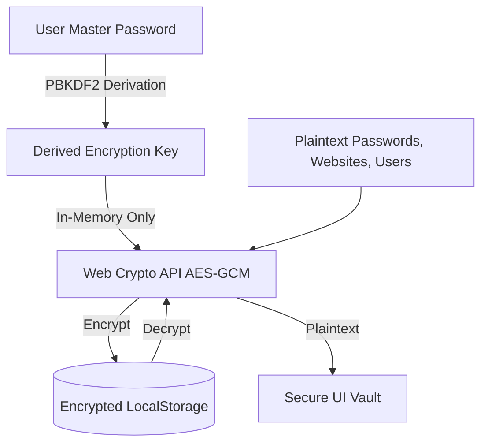

# 🛡️ React Password Generator

> **Your secure, local-first credential generator and vault.** Generate cryptographically secure passwords, track custom metadata, and secure your vaults with client-side zero-knowledge encryption.

[](https://vite.dev/)
[](https://react.dev/)
[](https://www.typescriptlang.org/)
[](https://mantine.dev/)
[](https://biomejs.dev/)

---

## ✨ Key Features

*   **🎲 Secure Generator Engine**
    *   Generate random character arrays instantly with custom specifications (uppercase letters, lowercase letters, numbers, and special characters).
    *   Real-time length controller from 5 to 30 characters using a fluid slider.
*   **💾 Metadata-Rich Storage**
    *   Store saved credentials locally with structured fields:
        *   **Website / App URL or Identifier**
        *   **Username / Email**
        *   **Password**
    *   Auto-logs creation dates and manages individual vault records.
*   **✏️ Credentials Editor**
    *   Directly update the Username, Website, and Password fields of any existing entry through a secure, inline modal.
*   **🔒 Encrypted Vault Locking**
    *   Seamlessly toggle between unencrypted local database storage and a zero-knowledge passcode-locked storage.

---

## 🔒 Security & Privacy Blueprint

This app is built on a **zero-trust, local-first** design. Your raw passwords and master keys are never stored on any server.



### Encryption Mechanics
1.  **Zero Telemetry:** The application operates entirely client-side. There are no tracking scripts, analytics databases, or network calls sending your passwords to third parties.
2.  **Cryptographic Key Derivation:** Using the browser's native **Web Crypto API**, your master password is run through **PBKDF2** (with 100,000 iterations of SHA-256 and a random cryptographic salt) to derive a 256-bit AES key.
3.  **AES-GCM 256-bit Encryption:** All stored data—including username, website, and password—is encrypted using authenticated **AES-GCM** before being written to disk (`localStorage`).
4.  **Verification Token:** A separate validation string (`"verified"`) is encrypted using the derived key. Upon entry, the app attempts to decrypt this token. If successful, it unlocks the vault; if decryption fails, the vault remains securely locked.
5.  **In-Memory Lifecycle:** The Derived Encryption Key is stored only in the temporary React state. The moment you refresh, close the tab, lock the vault, or clear memory, the key is completely purged.

---

## 🛠️ Development & Commands

### Prerequisites
Make sure you have [Node.js](https://nodejs.org/) installed.

### Installation
Install the project dependencies using npm:
```bash
npm install
```

### Run Locally (Development)
Start the Vite development server:
```bash
npm run dev
```

### Lint & Format
Validate formatting, import sorting, and rules using BiomeJS:
```bash
npm run lint
```

### Production Build
Build and optimize the application for production deployment:
```bash
npm run build
```